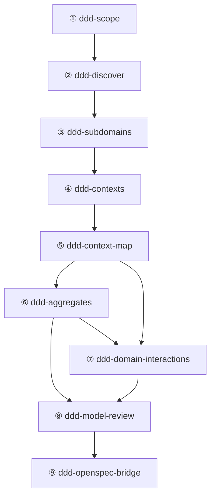

# DDD In-House Backbone System Design

> 🌐 中文版本: [Chinese](ddd-skill-system-design.md)

The open-source ecosystem provides numerous standalone DDD capabilities, but what AI Agents truly need is a **repeatable, loopable modeling pipeline**: from problem space discovery to strategic decomposition, from tactical modeling to model validation, forming a closed loop. To this end, this repository defines a set of `ddd-*` in-house skills under `skills/` as the system backbone — each skill is a **structured instruction for AI Agents (LLMs)**, executed in a single conversation turn to produce structured artifacts.

**Design boundary**: This system covers **domain modeling** (strategic + tactical) and **implementation specification bridging** (connecting to engineering implementation via OpenSpec). It does not cover concrete code implementation, testing strategy, or architecture compliance checking.

- `ddd-skills-report.en.md` — Research report on 20+ DDD skills with evaluation
- `ddd-openspec-mapping.en.md` — Mapping Guide: Standard definitions for converting DDD tactical artifacts to OpenSpec specifications

---


---

## 1. General Principles & Skill Interface Specification

### 1.1 Five-Stage Model

The system backbone adopts 5 stages, representing **5 different types of modeling work**, not strict linear steps:

| Stage | Name                    | Cognitive Mode           | Key Question                                                                  |
| :---- | :---------------------- | :----------------------- | :---------------------------------------------------------------------------- |
| I     | Problem Space Discovery | Divergent exploration    | What problem are we solving? What happens in the domain?                      |
| II    | Strategic Modeling      | Analytical decomposition | How to partition the domain? Where are the boundaries? How to unify language? |
| III   | Tactical Modeling       | Precise design           | What are the building blocks inside each boundary? How do they collaborate?   |
| IV    | Model Validation        | Critical review          | Is the model consistent, complete, and implementable?                         |
| V     | Specification Bridging  | Transformation mapping   | How to convert the domain model into executable engineering specifications?   |

### 1.2 Non-Linear and Bidirectional Closed Loop

Domain modeling is non-linear (ref. R07). Bidirectional feedback mechanisms exist between stages:

- **Forward progression**: From discovery to validation, ultimately outputting engineering specifications.
- **Backward backtracking**: When later stages discover issues, return to earlier stages for correction based on explicit "trigger-backtrack conditions" (see **Appendix B**).
- **Non-sequential entry**: For existing systems, you can enter from any stage (e.g., starting directly from tactical modeling); you only need to provide the prerequisite context for that stage.

### 1.3 Skill Interface Specification

Each `ddd-*` skill's SKILL.md must include the following structure to ensure AI Agent parseability and executability:

```yaml
---
name: ddd-<skill-name>
description: "<one-line description>"
risk: safe
source: self
tags: "[ddd, <stage>, <focus>]"
date_added: "<YYYY-MM-DD>"
---
```

The body must contain the following sections:

| Section                  | Responsibility      | Description                                             |
| :----------------------- | :------------------ | :------------------------------------------------------ |
| **When to Use**          | Trigger conditions  | When to invoke this skill                               |
| **Input Requirements**   | Prerequisites       | Required and optional inputs; annotate source skill     |
| **Process**              | Execution steps     | AI Agent's operation sequence (5-7 steps)               |
| **Output**               | Deliverable spec    | Table format: artifact name + structure requirements    |
| **Validation Checklist** | Exit gate           | All items must pass before delivery                     |
| **Backtrack Triggers**   | Feedback conditions | Specific conditions triggering return to upstream skill |
| **Example**              | Invocation demo     | Typical usage of `@skill-name`                          |

### 1.4 Non-Sequential Entry

Not all use cases start from Stage I. The system supports the following entry modes:

| Entry Skill        | Applicable Scenario                          | Prerequisites                             |
| :----------------- | :------------------------------------------- | :---------------------------------------- |
| `ddd-scope`        | New project or vague business needs          | None (entry point)                        |
| `ddd-discover`     | Requirements clear, direct exploration       | User provides scope context               |
| `ddd-contexts`     | Subdomains known, boundaries need refinement | User provides subdomain classification    |
| `ddd-aggregates`   | Single context needs tactical deepening      | User provides context definition          |
| `ddd-model-review` | Existing model needs quality assessment      | User provides existing modeling artifacts |

---

## 2. Stage & Skill Mapping

### 2.1 Skill Overview (9 Skills)

#### Stage I: Problem Space Discovery

| Skill          | Responsibility                                                        | Core Output                                                                        |
| :------------- | :-------------------------------------------------------------------- | :--------------------------------------------------------------------------------- |
| `ddd-scope`    | Converge fuzzy requirements into modeling inputs                      | Problem statement, goals/non-goals, constraints, terminology seeds, risk inventory |
| `ddd-discover` | Collaborative domain discovery (event storming / domain storytelling) | Event flow table, command/event candidates, hotspot annotations, ambiguity list    |

#### Stage II: Strategic Modeling

| Skill             | Responsibility                                             | Core Output                                                                                   |
| :---------------- | :--------------------------------------------------------- | :-------------------------------------------------------------------------------------------- |
| `ddd-subdomains`  | Identify business capabilities, classify subdomains        | Capability list, subdomain classification, core domain declaration, ownership recommendations |
| `ddd-contexts`    | Design Bounded Contexts and Ubiquitous Language            | Context directory (responsibilities + language + ownership), boundary ADRs, glossary          |
| `ddd-context-map` | Map inter-context relationships and integration strategies | Relationship matrix, integration patterns, contract ownership, failure modes                  |

#### Stage III: Tactical Modeling

| Skill                     | Responsibility                                          | Core Output                                                                                                |
| :------------------------ | :------------------------------------------------------ | :--------------------------------------------------------------------------------------------------------- |
| `ddd-aggregates`          | Design aggregate boundaries from invariants             | Aggregate directory (root + entities + VOs), invariant table, transaction boundaries, consistency strategy |
| `ddd-domain-interactions` | Design collaboration mechanisms between building blocks | Domain event directory, domain service definitions, repository interfaces, factory list                    |

#### Stage IV: Model Validation

| Skill              | Responsibility                                    | Core Output                                            |
| :----------------- | :------------------------------------------------ | :----------------------------------------------------- |
| `ddd-model-review` | Holistic model quality assessment & feedback loop | Consistency scores, issue list, backtrack trigger list |

#### Stage V: Specification Bridging

| Skill                 | Responsibility                                                   | Core Output                                         |
| :-------------------- | :--------------------------------------------------------------- | :-------------------------------------------------- |
| `ddd-openspec-bridge` | Map DDD tactical artifacts to OpenSpec structured specifications | OpenSpec changeset (Proposal, Design, Specs, Tasks) |

### 2.2 Dependency Graph



### 2.3 Input/Output Flow Table

| Source Skill                | Produced Artifacts                                                           | Consumed By                   |
| :-------------------------- | :--------------------------------------------------------------------------- | :---------------------------- |
| ① `ddd-scope`               | Problem statement, goals/non-goals, constraints, terminology seeds, risks    | ② ③ ④ ⑨                       |
| ② `ddd-discover`            | Event flow table, command/event candidates, hotspots, ambiguity list         | ③ ④ ⑤ ⑥ ⑦ ⑨                   |
| ③ `ddd-subdomains`          | Capability list, subdomain classification, core domain declaration           | ④ ⑤ ⑧ ⑨                       |
| ④ `ddd-contexts`            | Context directory, boundary ADRs, glossary                                   | ⑤ ⑥ ⑦ ⑧ ⑨                     |
| ⑤ `ddd-context-map`         | Relationship matrix, integration patterns, contract ownership, failure modes | ⑥ ⑦ ⑧ ⑨                       |
| ⑥ `ddd-aggregates`          | Aggregate directory, invariant table, transaction boundaries                 | ⑦ ⑧ ⑨                         |
| ⑦ `ddd-domain-interactions` | Event directory, service definitions, repository interfaces, factory list    | ⑧ ⑨                           |
| ⑧ `ddd-model-review`        | Scores, issue list, backtrack triggers                                       | ①②③④⑤⑥⑦ (via feedback loop) ⑨ |
| ⑨ `ddd-openspec-bridge`     | OpenSpec Proposal/Design/Specs/Tasks                                         | Development Implementation    |

### 2.4 Optional Enhancements (External Skills)

Backbone skills can optionally attach external skills at each stage for capability enhancement:

| Stage | System Backbone                                     | Optional Enhancement (External)                                                                               |
| :---- | :-------------------------------------------------- | :------------------------------------------------------------------------------------------------------------ |
| I     | `ddd-scope`, `ddd-discover`                         | `ddd-strategic-design` (early classification), `ddd-planning` (event storming template)                       |
| II    | `ddd-subdomains`, `ddd-contexts`, `ddd-context-map` | `ddd-context-mapping` (integration pattern reinforcement), `domain-driven-design` (strategic artifact checks) |
| III   | `ddd-aggregates`, `ddd-domain-interactions`         | `domain-driven-design` (tactical modeling framework), `clean-ddd-hexagonal` (dependency rule decision tree)   |
| IV    | `ddd-model-review`                                  | `clean-architecture` (scoring reinforcement)                                                                  |
| V     | `ddd-openspec-bridge`                               | `openspec-assistant` (specification generation & validation)                                                  |

---

## 3. Reference Materials & Skill Mapping

To support continuous optimization of the `skills/ddd-*` in-house backbone, this section captures free learning materials from `ddd-crew/free-ddd-learning-resources` as a reusable reference list, mapping each resource to the specific skill and section it can directly strengthen, ensuring changes are traceable, reusable, and iteratively processable.

### 3.1 Reference List (with Metadata)

To ensure the authority and comprehensiveness of theoretical sources, the following list collects classic works, practice guides, and case studies in the DDD domain. These references span strategic design, collaborative modeling, and tactical implementation, forming the knowledge foundation for subsequent backbone optimization.

| ID  | Topic                   | Title                                                     | Type          | Author/Organization                  | Year | Link                                                                                                            |
| :-- | :---------------------- | :-------------------------------------------------------- | :------------ | :----------------------------------- | :--- | :-------------------------------------------------------------------------------------------------------------- |
| R01 | Fundamentals            | Domain-Driven Design Reference                            | EBook (PDF)   | Eric Evans                           | 2015 | <https://domainlanguage.com/wp-content/uploads/2016/05/DDD_Reference_2015-03.pdf>                               |
| R02 | Fundamentals            | Domain-Driven Design Quickly                              | EBook         | Abel Avram, Floyd Marinescu          |      | <https://www.infoq.com/minibooks/domain-driven-design-quickly/>                                                 |
| R03 | Fundamentals            | DDD: The First 15 Years                                   | EBook         | Various Authors                      |      | <https://leanpub.com/ddd_first_15_years>                                                                        |
| R04 | Fundamentals            | The Anatomy of Domain-Driven Design                       | EBook         | Scott Millett, Samuel Knight         |      | <https://leanpub.com/theanatomyofdomain-drivendesign>                                                           |
| R05 | Fundamentals            | Domain-Driven Design                                      | Article       | Martin Fowler                        |      | <https://martinfowler.com/bliki/DomainDrivenDesign.html>                                                        |
| R06 | Fundamentals            | Domain-driven design needn't be hard. Here's how to start | Article       | Thoughtworks (Andrew Hamel-law)      |      | <https://www.thoughtworks.com/insights/blog/domain-driven-design-neednt-be-hard-heres-how-start>                |
| R07 | Process                 | DDD Starter Modelling Process                             | Repo          | `ddd-crew`                           |      | <https://github.com/ddd-crew/ddd-starter-modelling-process>                                                     |
| R08 | Fundamentals            | What is DDD?                                              | Video         | Eric Evans                           |      | <https://www.youtube.com/watch?v=pMuiVlnGqjk>                                                                   |
| R09 | Fundamentals            | Tackling Complexity in the Heart of Software              | Video         | Eric Evans                           |      | <https://www.youtube.com/watch?v=dnUFEg68ESM>                                                                   |
| R10 | Collaborative Modelling | Event Storming                                            | Practice      | Open Practice Library                |      | <https://openpracticelibrary.com/practice/event-storming/>                                                      |
| R11 | Collaborative Modelling | Domain Storytelling                                       | Practice      | Open Practice Library                |      | <https://openpracticelibrary.com/practice/domain-storytelling/>                                                 |
| R12 | Collaborative Modelling | 100,000 Orange Stickies Later                             | Video         | Alberto Brandolini                   |      | <https://www.youtube.com/watch?v=fGm62ra_mQ8>                                                                   |
| R13 | Collaborative Modelling | Awesome EventStorming                                     | Repo          | Mariusz Gil                          |      | <https://github.com/mariuszgil/awesome-eventstorming>                                                           |
| R14 | Strategic Design        | Bounded Context                                           | Article       | Martin Fowler                        |      | <https://martinfowler.com/bliki/BoundedContext.html>                                                            |
| R15 | Strategic Design        | Bounded Contexts                                          | Video         | Cyrille Martraire                    |      | <https://www.youtube.com/watch?v=ZEJ2Vyk1HA0>                                                                   |
| R16 | Strategic Design        | Practical DDD: Bounded Contexts + Events                  | Video         | Indu Alagarsamy                      |      | <https://www.youtube.com/watch?v=Nr6jAwOunGM>                                                                   |
| R17 | Strategic Design        | Emergent Boundaries                                       | Article/Video | Matthias Verraes                     | 2017 | <https://verraes.net/2017/04/emergent-boundaries/>                                                              |
| R18 | Strategic Design        | Socio-technical architecture                              | Video         | Ora Egozi Barzilai, Evelyn van Kelle |      | <https://www.youtube.com/watch?v=9Ft39wz6fHM>                                                                   |
| R19 | Tactical DDD            | All Our Aggregates Are Wrong                              | Video         | Mauro Servienti                      |      | <https://www.youtube.com/watch?v=KkzvQSuYd5I>                                                                   |
| R20 | Strategic Design        | Aligning organization and architecture with strategic DDD | Slides        | Michael Plod                         |      | <https://speakerdeck.com/mploed/aligning-organization-and-architecture-with-strategic-ddd>                      |
| R21 | Strategic Design        | Strategic Domain-Driven Design Kata: Delivericious        | Case Study    | Nick Tune                            |      | <https://medium.com/nick-tune-tech-strategy-blog/strategic-domain-driven-design-kata-delivericious-b114ca77163> |
| R22 | Tactical DDD            | Architecture Patterns with Python                         | EBook         | Harry Percival, Bob Gregory          |      | <http://www.cosmicpython.com>                                                                                   |
| R23 | Tactical DDD            | Aggregates & Entities in Domain-Driven Design             | Article       | Paul Rayner                          |      | <http://thepaulrayner.com/blog/aggregates-and-entities-in-domain-driven-design/>                                |
| R24 | Tactical DDD            | Strengthening your domain: a primer                       | Article       | Jimmy Bogard                         | 2010 | <https://lostechies.com/jimmybogard/2010/02/04/strengthening-your-domain-a-primer/>                             |
| R25 | Tactical DDD            | Domain Modeling Made Functional                           | Video         | Scott Wlaschin                       |      | <https://www.youtube.com/watch?v=1pSH8kElmM4>                                                                   |
| R26 | Tactical DDD            | Design in the small                                       | Video         | Yves Reynhout                        |      | <https://www.youtube.com/watch?v=3iLW4puXHvc>                                                                   |
| R27 | Engineering             | Refactoring for DDD Without Microservicing Your Monolith  | Video         | Harry Brumleve                       |      | <https://www.youtube.com/watch?v=y2mL-6CcYBw>                                                                   |
| R28 | Tactical DDD            | DDD By Examples                                           | Repo          | Jakub Pilimon, Bartlomiej Slota      |      | <https://github.com/ddd-by-examples/library>                                                                    |
| R29 | Case Study              | 10 Lessons from a Long Running DDD Project (Part 1)       | Article       | Jimmy Bogard                         | 2016 | <https://lostechies.com/jimmybogard/2016/06/13/10-lessons-from-a-long-running-ddd-project-part-1/>              |
| R30 | Case Study              | OOps I DDD it again and again                             | Slides        | Ora Egozi-Barzilai                   |      | <https://www.slideshare.net/OraEgoziBarzilai/mucon-2019-oops-i-ddd-it-again-and-again>                          |

### 3.2 Reference -> In-House Skill/Section Improvement Mapping (Suggested Backlog)

Transforming external knowledge into executable modeling specifications is key to system evolution. The table below establishes direct mappings from theoretical references to specific skill improvement points, prioritized by business value and foundational gap severity (P0 to P2), providing a clear execution backlog for subsequent skill iterations.

| Ref ID | Priority | Status | Target Skill                | Target Section                 | Suggested Improvement                                                                                                                                                                     |
| :----- | :------- | :----- | :-------------------------- | :----------------------------- | :---------------------------------------------------------------------------------------------------------------------------------------------------------------------------------------- |
| R07    | P0       | Done   | Global top-level meta-rules | General principles             | ~~Introduce "non-linear, loopable" modeling process principle~~ -> Implemented in §1.2 Non-Linear and Bidirectional Closed Loop.                                                          |
| R06    | P1       | Open   | `ddd-scope`                 | Process / Output               | Introduce Thoughtworks' progressive DDD startup methodology to strengthen the "where to start" decision framework in scope convergence.                                                   |
| R09    | P2       | Open   | `ddd-scope`                 | Process / Checklist            | Add "model at the heart of complexity" mindset prompt: avoid over-investing modeling effort in non-core domains.                                                                          |
| R10    | P0       | Open   | `ddd-discover`              | Process / Output               | Complete Event Storming standard steps and participant roles; formalize exception flows, hotspot annotations, and ambiguity handling as output fields.                                    |
| R12    | P1       | Open   | `ddd-discover`              | Backtrack Triggers             | Add typical failure modes for large-scale collaborative modeling: facilitation cadence, sticky note semantic consistency, disagreement convergence, and post-session capture.             |
| R11    | P1       | Open   | `ddd-discover`              | Process (alternative method)   | Introduce Domain Storytelling as an alternative discovery method to event storming, adding the "actor-action-object" narrative structure.                                                 |
| R21    | P1       | Open   | `ddd-subdomains`            | Output / Example               | Provide reusable Kata exercise formats and output templates; map exercise deliverables to subdomain classification tables and core domain declarations.                                   |
| R18    | P1       | Open   | `ddd-subdomains`            | Process / Ownership            | Introduce socio-technical architecture perspective: team cognitive load, Conway's Law effects on subdomain partitioning.                                                                  |
| R14    | P0       | Open   | `ddd-contexts`              | Process / Checklist            | Strengthen Bounded Context language and model boundaries; add "non-responsibilities" and "data ownership conflict" check items.                                                           |
| R20    | P0       | Open   | `ddd-contexts`              | Output / ADR                   | Introduce organization-architecture alignment perspective: team boundaries, owner, decision authority; add "boundaries don't evolve with teams" risk prompt.                              |
| R15    | P1       | Open   | `ddd-contexts`              | Process                        | Introduce Cyrille Martraire's Bounded Context lifecycle perspective: nascent, mature, bubble, and autonomous contexts.                                                                    |
| R17    | P1       | Open   | `ddd-contexts`              | Backtrack Triggers             | Introduce "emergent boundaries" thinking: boundaries are not one-time decisions, requiring continuous observation and adjustment; refine signals for triggering boundary re-partitioning. |
| R16    | P0       | Open   | `ddd-context-map`           | Process / Output               | Introduce Bounded Context + Events practice pattern: use events as clues to draw context maps, strengthening contract discovery.                                                          |
| R27    | P1       | Open   | `ddd-context-map`           | Failure Modes / Translation    | Introduce "brownfield refactoring without microservicing" strategy: establish ACL boundaries first, then progressively decompose; add legacy system integration patterns.                 |
| R23    | P0       | Open   | `ddd-aggregates`            | Process / Checklist            | Make aggregate partitioning core principles explicit: invariants, transaction boundaries, cross-aggregate references; add "aggregates defined by foreign keys" anti-pattern check.        |
| R19    | P0       | Open   | `ddd-aggregates`            | Backtrack Triggers             | Add "aggregates commonly misdesigned" anti-pattern collection and correction steps: shrink consistency boundaries, event-driven eventual consistency, compensation strategies.            |
| R24    | P1       | Open   | `ddd-aggregates`            | Checklist                      | Strengthen domain model "strength" requirements: invariant expression first; add weak aggregate identification criteria and improvement paths.                                            |
| R26    | P2       | Open   | `ddd-aggregates`            | Process (Entity/VO)            | Introduce Yves Reynhout's "design in the small" thinking: value objects first, entity minimization, aggregate root behavioral richness.                                                   |
| R25    | P1       | Open   | `ddd-domain-interactions`   | Process / Output               | Introduce functional domain modeling perspective: use type systems to express domain events and state transitions, strengthening event contract precision.                                |
| R22    | P1       | Open   | `ddd-domain-interactions`   | Repository Interface / Process | Provide reference paradigms for repository interface design in domain modeling: aggregate loading, persistence contracts, and query boundaries.                                           |
| R28    | P1       | Open   | `ddd-domain-interactions`   | Example                        | Introduce DDD By Examples (Library case) event-driven design patterns as reference examples for domain interaction design.                                                                |
| R29    | P1       | Open   | `ddd-model-review`          | Issue List / Backtrack         | Extract common issues from long-running project experience: boundary drift, event proliferation, terminology degradation; refine backtrack trigger conditions.                            |
| R30    | P2       | Open   | `ddd-model-review`          | Scoring Dimensions             | Introduce lessons learned from repeated "DDD done wrong" experiences, adding common model degradation signals and preventive measures.                                                    |
| R03    | P2       | Open   | `ddd-model-review`          | Checklist                      | Extract long-term model quality measurement standards and evolution patterns from the multi-practitioner experiences in "DDD 15 Years."                                                   |

> **Note**:
>
> - R13 (`Awesome EventStorming`) is categorized as a "tools and resource pool"; it does not directly serve as an improvement target but rather as an extended reference library for `ddd-discover`.
> - R01-R05, R08 are DDD foundational theory, serving as the knowledge base for all skills without mapping to specific improvement points.

---

## Appendix A: Quick Start Example ("Meeting Room Booking System")

This appendix demonstrates the collaboration flow of the 9 backbone skills in a real scenario (this section focuses on the modeling collaboration of Stages I-IV; for Stage V `ddd-openspec-bridge` specification output examples, see [ddd-openspec-mapping.en.md](ddd-openspec-mapping.en.md)).

### A.1 Stage I: Problem Space Discovery

**`ddd-scope` (①)**

- **Input**: Business vision: "We want employees to book available meeting rooms anytime, avoiding time conflicts."
- **Output**:
    - Problem statement: "Meeting room resources lack unified management; frequent time conflicts reduce employee efficiency."
    - Goals: Support time-slot booking, conflict detection, check-in confirmation.
    - Non-goals: Does not cover meeting room equipment maintenance; does not cover video conference scheduling.
    - Constraints: Booking duration must be multiples of 30 minutes; each person can have at most 1 booking per time slot.
    - Terminology seeds: Booking, Room, TimeSlot, CheckIn.
- **Validation Checklist**:
    - [x] Goals and non-goals are mutually exclusive and actionable
    - [x] Constraints are verifiable

**`ddd-discover` (②)**

- **Input**: Scope output from ①.
- **Output (event flow fragment)**:

    | Seq | Event            | Triggering Command | Participant | Exception Path                               |
    | :-- | :--------------- | :----------------- | :---------- | :------------------------------------------- |
    | 1   | RoomRegistered   | RegisterRoom       | Admin       | —                                            |
    | 2   | BookingRequested | RequestBooking     | Employee    | Time slot full -> BookingRejected            |
    | 3   | BookingConfirmed | ConfirmBooking     | System      | Conflict detection fails -> BookingRejected  |
    | 4   | CheckInRecorded  | RecordCheckIn      | Employee    | Timeout without check-in -> BookingCancelled |

- **Hotspot annotations**: BookingConfirmed is a strong consistency point (concurrent competition for time slots).
- **Ambiguity**: Does "booking" mean a request or a confirmed reservation? Two-state distinction must be clarified.

### A.2 Stage II: Strategic Modeling

**`ddd-subdomains` (③)**

| Capability                       | Subdomain Type | Rationale                                                                           |
| :------------------------------- | :------------- | :---------------------------------------------------------------------------------- |
| Booking & Conflict Management    | Core           | Core competitive advantage: precise time conflict detection and concurrency control |
| Meeting Room Resource Management | Supporting     | Necessary but non-differentiating                                                   |
| User Identity & Permissions      | Generic        | General-purpose capability, reusable from existing systems                          |

**`ddd-contexts` (④)**

| Context      | Responsibilities                                           | Core Terms                       | Ownership     |
| :----------- | :--------------------------------------------------------- | :------------------------------- | :------------ |
| Booking      | Full booking lifecycle: request, confirm, cancel, check-in | Booking, TimeSlot, BookingPolicy | Booking Team  |
| Room Catalog | Room registration, capacity, equipment, availability       | Room, Capacity, Equipment        | Admin Team    |
| Identity     | User authentication and authorization                      | User, Role, Permission           | Platform Team |

- **Boundary ADR**: In the Booking context, Room is only a RoomId reference, not holding Room details; availability must be queried.
- **Glossary conflict resolution**: "Room" in Booking is RoomId (identifier), in Room Catalog it is a complete entity.

**`ddd-context-map` (⑤)**

| Upstream     | Downstream | Pattern                     | Description                                   |
| :----------- | :--------- | :-------------------------- | :-------------------------------------------- |
| Room Catalog | Booking    | OHS (Open Host Service)     | Booking queries available room list           |
| Identity     | Booking    | ACL (Anti-Corruption Layer) | Booking translates UserId into Booker concept |

- **Failure mode**: When Room Catalog is unavailable, Booking degrades to "only allowing bookings with known RoomIds."

### A.3 Stage III: Tactical Modeling

**`ddd-aggregates` (⑥)**

| Aggregate | Aggregate Root | Contains                          | Key Invariant                                                 |
| :-------- | :------------- | :-------------------------------- | :------------------------------------------------------------ |
| Booking   | Booking        | TimeSlot (VO), BookingStatus (VO) | The same Room and TimeSlot cannot have two Confirmed Bookings |
| Room      | Room           | Capacity (VO), Equipment (VO)     | Room must have a unique identifier and non-zero capacity      |

- **Transaction boundary**: Default is one transaction modifies one aggregate.
- **Cross-aggregate consistency**: Booking confirmation requires querying Room availability -> achieved through domain events + optimistic locking.

**`ddd-domain-interactions` (⑦)**

| Domain Event     | Source Aggregate | Trigger Condition        | Consumer                        | Idempotency Key     |
| :--------------- | :--------------- | :----------------------- | :------------------------------ | :------------------ |
| BookingConfirmed | Booking          | Conflict detection pass  | Notification service (external) | BookingId + Version |
| BookingCancelled | Booking          | Timeout without check-in | Room Catalog (release slot)     | BookingId           |

- **Repository interface**: `BookingRepository.findByRoomAndTimeSlot(roomId, timeSlot)` — for conflict detection.
- **Domain service**: `ConflictDetectionService` — cross-Booking aggregate check for same-slot occupancy.

### A.4 Stage IV: Model Validation

**`ddd-model-review` (⑧)**

| Dimension               | Score | Finding                                                                                                   |
| :---------------------- | :---- | :-------------------------------------------------------------------------------------------------------- |
| Terminology consistency | 9/10  | "Room" cross-context meaning clearly distinguished                                                        |
| Aggregate boundaries    | 7/10  | ConflictDetectionService requires cross-aggregate query -> evaluate whether boundary adjustment is needed |
| Event completeness      | 8/10  | Missing formal definition for BookingRejected event                                                       |

- **Backtrack trigger**: Aggregate score 7/10 -> recommend returning to ⑥ `ddd-aggregates` to evaluate whether TimeSlot availability should be promoted to an independent aggregate (RoomSchedule) to eliminate cross-aggregate queries.

### A.5 Feedback Loop Example

The above review triggers backtracking to ⑥ `ddd-aggregates`:

- **Adjustment**: Introduce a `RoomSchedule` aggregate, holding all time slot occupancy states for a given Room.
- **New invariant**: Within RoomSchedule, the same TimeSlot allows only one Confirmed occupancy.
- **Impact**: ConflictDetectionService is eliminated; conflict detection is internalized as a RoomSchedule aggregate invariant.
- **Re-validation**: Aggregate score improves to 9/10, no new backtrack triggers.

---

## Appendix B: Backtrack Trigger Condition Matrix

The following matrix codifies issues that may be discovered during each skill's execution into actionable backtrack rules, avoiding inconsistency from experience-based judgment:

| Detecting Skill             | Trigger Condition                                                        | Backtrack To | Skill(s) to Re-Execute            | Explanation                                                    |
| :-------------------------- | :----------------------------------------------------------------------- | :----------- | :-------------------------------- | :------------------------------------------------------------- |
| ⑧ `ddd-model-review`        | Aggregate boundaries contradict context boundaries                       | Stage II     | `ddd-contexts`                    | Contexts need re-partitioning for consistency                  |
| ⑧ `ddd-model-review`        | Terminology conflict rate > 20%                                          | Stage II     | `ddd-contexts`                    | Ubiquitous Language definitions insufficient                   |
| ⑧ `ddd-model-review`        | Invariant expression rate < 60% (aggregates lack explicit invariants)    | Stage III    | `ddd-aggregates`                  | Aggregates may be data containers, not behavioral boundaries   |
| ⑧ `ddd-model-review`        | Integration patterns inconsistent with context mapping                   | Stage II     | `ddd-context-map`                 | Tactical layer discovered new integration needs                |
| ⑧ `ddd-model-review`        | Event completeness < 70% (event directory incomplete)                    | Stage III    | `ddd-domain-interactions`         | Event directory missing critical flows                         |
| ⑦ `ddd-domain-interactions` | Events need to carry another aggregate's private data                    | Stage III    | `ddd-aggregates`                  | Aggregate boundaries need adjustment for self-contained events |
| ⑥ `ddd-aggregates`          | Invariants span multiple contexts                                        | Stage II     | `ddd-contexts`                    | Consistency requirements fragmented by boundaries              |
| ⑤ `ddd-context-map`         | Circular dependencies or single context bears > 3 upstream relationships | Stage II     | `ddd-subdomains` / `ddd-contexts` | Possible "god context" or subdomain misclassification          |
| ④ `ddd-contexts`            | > 5 terms have irreconcilable cross-context conflicts                    | Stage I      | `ddd-discover`                    | Domain understanding insufficient                              |
| ③ `ddd-subdomains`          | Cannot distinguish Core from Supporting (no differentiating capability)  | Stage I      | `ddd-scope`                       | Business value proposition unclear                             |

> **Infinite loop prevention**: The same backtrack path may be executed at most 3 times. If triggered a 3rd time, escalate to `ddd-scope` for business goal realignment, or flag as "architectural decision requiring human intervention."
